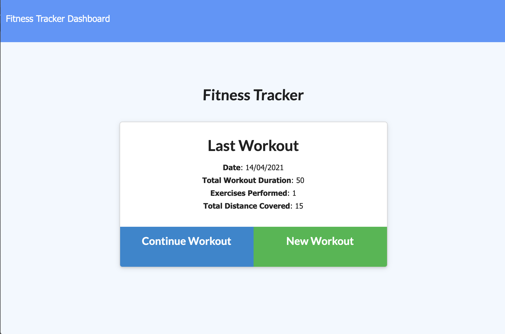
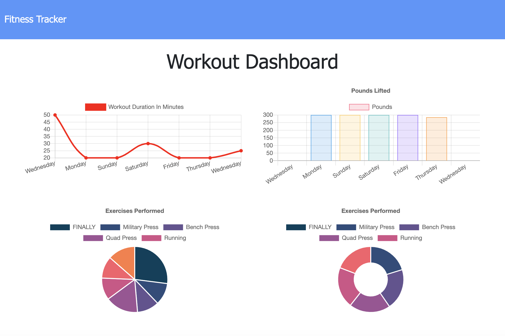

# Workout Tracker App

This web application uses a remote server and a mongo database to manage a list of workouts with an array of exercises, calculating the full workout duration, accumulated weight and displaying it in a set of graphs. 

[See deployed application.](https://evening-tor-97642.herokuapp.com/)

 # Table of contents
 - [Motivation](#motivation)
 - [Built with](#built-with)
 - [Features](#features)
 - [Installation](#installation)
 - [Roadmap](#roadmap)

## Motivation
As someone interested in staying fit, a simple and easy to use application that allows the user to track and compare their progress through their weekly workouts is a great way to stay motivated.

## Built with
- [Node.js](https://nodejs.org/en/)
- [Express](https://expressjs.com/)
- [MongoDB](https://www.mongodb.com/)

## Features
The application allows the user to add .
###  [See deployed application.](https://evening-tor-97642.herokuapp.com/)

## Installation
To install this application locally, download the package, and install the necessary dependencies by navigating to the application folder in your terminal and running `npm install`. Now you are ready, start the server from the folder using `node server.js` command. When the connection is established, visit `http://localhost:8000/` from your browser to go to the application.

## Roadmap
Future updates for this application include updating the UI design and making it more user friendly, as well as adding more workout categories.

